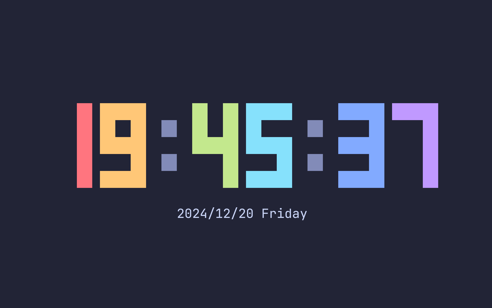

# termclock

A clock application for the terminal.

## Pictures



## Usage

```
Usage: termclock [OPTIONS] <COMMAND>

Commands:
  clock     Use as a clock
  complete  Print shell auto completions for the specified shell
  help      Print this message or the help of the given subcommand(s)

Options:
  -c, --color <COLOR>            The color of the clock numbers [default: green]
  -:, --color-delimiter <COLOR>  The color of the delimiter ':' between numbers [default: green]
  -h, --help                     Print help
  -V, --version                  Print version
```
```
Usage: termclock clock [OPTIONS]

Options:
  -r, --rainbow-mode             Whether to use a rainbow effect for the clock. Will override the color options
  -f, --scale <SCALE>            The scale of the clock. Automatically adjusted to fit the terminal size if not set
  -c, --color <COLOR>            The color of the clock numbers [default: green]
  -s, --with-seconds             Do not show seconds
  -1, --one-position <POSITION>  The position of the number one in the clock to display [default: right] [possible values: left, middle, right]
  -:, --color-delimiter <COLOR>  The color of the delimiter ':' between numbers [default: green]
  -d, --with-date                Whether to display date
  -F, --date-format <FORMAT>     The format of the date [default: "%Y/%m/%d %A"]
  -S, --screensaver              Screensaver mode, quit on any key
  -h, --help                     Print help

```
